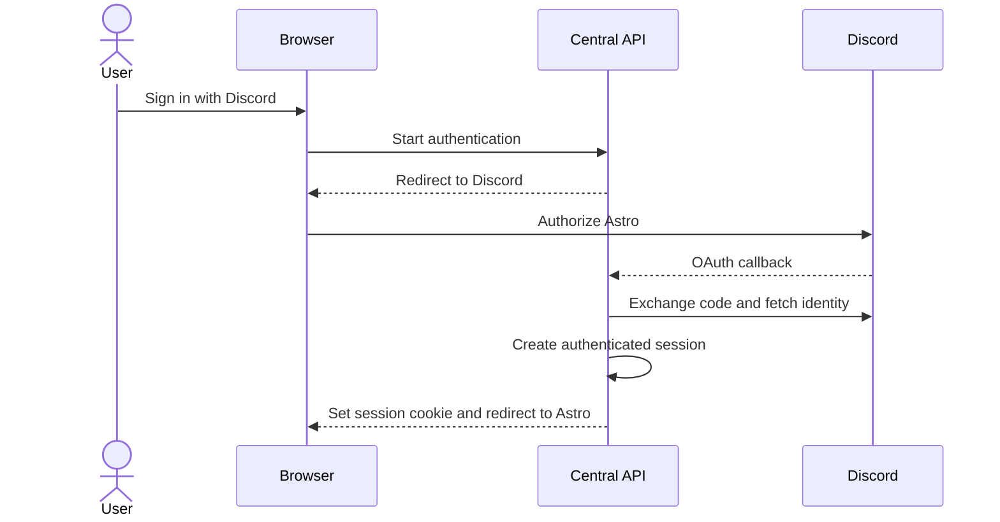
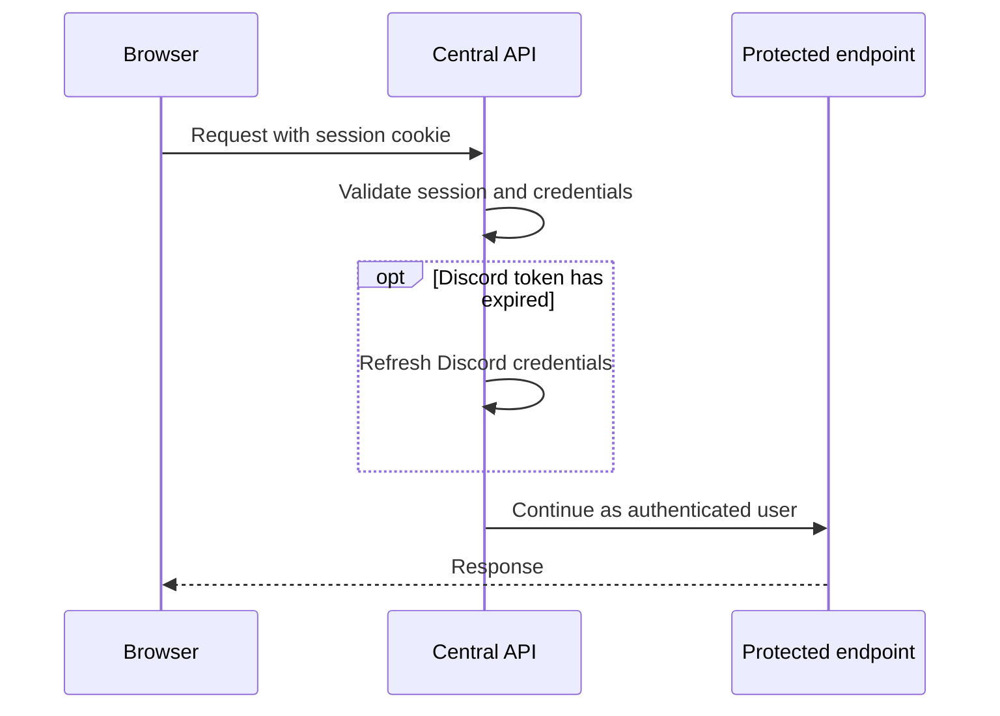

# Authentication

Astro authenticates users through Discord OAuth 2.

The API keeps Discord tokens and sessions server-side, the browser receives only an HTTP-only session cookie.

## Sign in

The same flow can optionally include installing the Astro bot in a Discord
server.

## Authenticated requests

The current-user endpoint returns the corresponding Astro user. If that user
does not exist yet, Astro creates it on first access.
